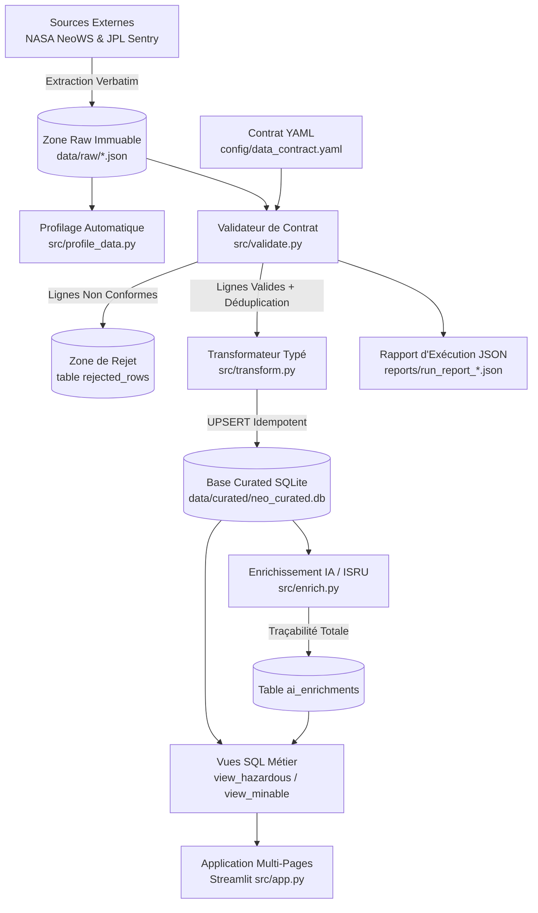

# 🌌 ExoWatch — NEO Intelligence Platform (v3)

[](https://python.org)
[](https://streamlit.io)
[](https://sqlite.org)
[](https://docs.pytest.org)

**ExoWatch** est une plateforme analytique d'ingestion robuste, de validation contractuelle et de valorisation scientifique d'astéroïdes proches de la Terre (**Near Earth Objects — NEOs**).

Conçu selon les exigences du **TP ESEO**, ce projet démontre une rigueur d'ingénierie des données sans sur-ingénierie inutile : pipeline batch reproductible, zone de rejet documentée, garantie stricte d'idempotence, séparation hermétique entre mesures instrumentales et inférences d'IA, et interface multi-pages interactive sous Streamlit.

---

## 🏗️ 1. Architecture Globale

Le flux de données suit un cycle batch contrôlé de bout en bout :



---

## 📜 2. Contrat de Données & Règles Qualité

La qualité des données est définie déclarativement dans [`config/data_contract.yaml`](config/data_contract.yaml) et appliquée par des fonctions pures et testables dans [`src/validate.py`](src/validate.py) :

| Règle | Nom | Champ visé | Type & Condition | Action | Description |
| :--- | :--- | :--- | :--- | :--- | :--- |
| **R1** | `entity_id_not_null` | `entity_id` | `not_null` | **Reject** | L'identifiant NeoWS est obligatoire et non vide. |
| **R2** | `observed_at_valid_date` | `observed_at` | `date_format` (`%Y-%m-%d`, $\le$ today) | **Reject** | Date d'observation valide et passée ou présente. |
| **R3** | `diameter_positive` | `diameter_km_min` | `range` ($0.0001 \le d \le 1000.0$) | **Reject** | Diamètre estimé strictement positif et physiquement plausible. |
| **R4** | `velocity_plausible_range` | `velocity_kmh` | `range` ($1.0 \le v \le 200000.0$) | **Flag** | Vélocité relative réaliste (flag analytique, non bloquant). |
| **R5** | `unique_business_key` | `[entity_id, observed_at]` | `uniqueness` | **Deduplicate** | Déduplication sur la clé métier (conserve l'occurrence la plus récente). |
| **R6** | `miss_distance_positive` | `miss_distance_km` | `range` ($d \ge 0.0$) | **Reject** | Distance de croisement positive ou nulle. |

---

## 🛡️ 3. Garantie d'Idempotence & Traçabilité IA

### Idempotence à 100%
La clé métier unique est définie par le couple `(entity_id, observed_at)` dans la table SQLite `neo_observations` :
```sql
UNIQUE(entity_id, observed_at)
```
L'insertion s'effectue via une clause **`ON CONFLICT(entity_id, observed_at) DO UPDATE SET`** (UPSERT). Rejouer le pipeline 10 fois sur le même fichier brut garantit **zéro doublon** dans la base.

### Isolation Hermétique Mesuré vs Inféré
Les mesures physiques objectives issues des télescopes ne sont **jamais modifiées** par les inférences d'IA. Toutes les évaluations minières (ISRU) sont stockées dans la table dédiée `ai_enrichments` avec :
- `model_used` (ex: `google/gemini-2.0-flash` ou fallback scientifique)
- `prompt_version` (ex: `v1.2`)
- `confidence` (score normalisé $[0.0, 1.0]$)
- `pipeline_run_id` (lien vers le batch d'ingestion)

---

## 🚀 4. Guide d'Exécution & Démarrage Rapide

### Prérequis
- Python 3.10 ou supérieur (testé avec succès sous Python 3.12)
- Clé API NASA (optionnelle, `DEMO_KEY` par défaut)
- Clé API OpenRouter / OpenAI (optionnelle, fallback heuristique déterministe inclus)

### Installation
```bash
# 1. Cloner le dépôt
git clone <url-du-repo>
cd exowatch

# 2. Créer et activer un environnement virtuel
python -m venv .venv
# Sur Windows :
.\.venv\Scripts\activate
# Sur Linux/macOS :
source .venv/bin/activate

# 3. Installer les dépendances
pip install -r requirements.txt

# 4. Configurer les variables d'environnement
cp .env.example .env
```

### Initialisation & Pipeline
```bash
# Initialiser le schéma de base SQLite et les vues
python -m src.db

# Exécuter le pipeline complet (Collecte -> Profilage -> Validation -> Curation -> Enrichissement -> Rapport)
python -m src.pipeline

# Optionnel : exécuter sans enrichissement IA
python -m src.pipeline --no-enrich
```

### Lancement des Tests Unitaires
```bash
python -m pytest tests/ -v
```
*Tous les 8 tests (idempotence + les 6 règles de contrat qualité) passent au vert.*

### Lancement de l'Application Streamlit
```bash
streamlit run src/app.py
```
L'application est immédiatement accessible dans votre navigateur à l'adresse : **`http://localhost:8501`**.

---

## 🛡️ 4. Couche de Décision & Design System "Mission Control"

### Score Composite de Priorité d'Action (`src/decision.py`)
Au-delà de la simple visualisation, ExoWatch intègre une **couche décisionnelle opérationnelle** qui calcule à chaque run un score unique ($0 - 100$) pour orienter les analystes :
$$\text{Score} = (\text{Proximité} \times 0.40 + \text{Dangerosité} \times 0.35 + \text{Tendance} \times 0.25) \times 100$$
- **Proximité** : fonction inverse de la distance de croisement (périgée).
- **Dangerosité** : coefficient selon la classification binaire NASA PDCO.
- **Tendance Temporelle** : comparaison des 2 dernières observations documentées pour détecter les rapprochements accélérés.
- **Stockage Batch** : persisté dans la table `priority_scores` avec traçabilité par `run_id`.

### Design System HUD "Mission Control" (`src/ui/`)
- **Palette Spatiale Sombre** : Fond `#0A0E14` avec motif radar subtil (`radial-gradient`), accents Cyan `#00D9FF`, Ambre `#F59E0B` et Rouge Alerte `#FF4757`.
- **Cartes Instrument de Bord** (`render_kpi_card`) : Glow réactif au survol, typographie monospace technique **JetBrains Mono**.
- **Badges Pulsants** (`render_threat_badge`) : Pulsation CSS dynamique sur les menaces critiques.
- **Sparklines Intégrées** (`render_sparkline`) : Mini-graphiques de tendance temporelle sans axes parasites.

---

## 🖥️ 5. Pages de l'Application Streamlit

0. **Briefing Opérationnel du Jour (`pages/0_Briefing.py`) — *Page d'Accueil Décisionnelle*** :
   - Répond immédiatement à : *"Sur quoi l'équipe doit-elle agir aujourd'hui ?"*
   - **Top 3 Objets Critiques** : Cartes grand format avec badge de menace, sparkline temporelle, et **synthèse directive générée par LLM** (stockée sous `daily_brief_summary` pour une traçabilité totale).
   - **Alertes de Changement Récentes** : Détection des variations significatives de score de menace entre les deux derniers batchs.
   - **Opportunité Minière du Jour** : Meilleure cible d'exploitation in-situ (ISRU) avec jauge de confiance Plotly Dark.

1. **Dashboard de Synthèse (`src/app.py`)** :
   - KPIs d'instrumentation (Total observations, % astéroïdes dangereux, statut qualité du dernier run, total enrichis IA).
   - Graphiques interactifs Plotly : histogramme logarithmique des diamètres et corrélation Vélocité / Proximité.
   - Bouton de déclenchement batch direct.
   - Tableau de bord des 5 derniers runs (vue `view_data_quality_audit`).

2. **Objets Dangereux (`pages/1_Objets_dangereux.py`)** :
   - Exploite la vue SQL `view_hazardous` (croisement NeoWS + Sentry).
   - Filtres par distance de croisement (km / unités lunaires LD) et diamètre.
   - Fiche d'inspection détaillée d'un astéroïde sélectionné avec alertes visuelles sur les échelles de Turin et Palerme.

3. **Exploitation Minière (`pages/2_Exploitation_miniere.py`)** :
   - Exploite la vue SQL `view_minable` issue d'`ai_enrichments`.
   - Bannière d'avertissement épistémologique sur la nature inférée des données.
   - Filtres par potentiel minier (High, Medium, Low) et seuil de confiance.
   - Cartes expansibles avec jauges de confiance, score d'accessibilité orbital et argumentation scientifique issue du LLM.

4. **Traçabilité & Lignage (`pages/3_Tracabilite.py`)** :
   - Diagramme Mermaid du flux complet de données.
   - Moteur de recherche par identifiant (`entity_id`).
   - Comparaison en miroir : statut curated, rejets documentés avec motif contractuel, et historique d'inférence IA.

5. **Rapports d'Exécution (`pages/4_Rapports_execution.py`)** :
   - Graphique chronologique en barres empilées (lignes acceptées vs rejetées vs doublons évincés).
   - Sélecteur et inspecteur des rapports d'audit JSON (`reports/run_report_*.json`).
   - Bouton d'export direct du rapport JSON audité.

---

## ⚖️ 6. Justification des Choix Techniques

- **Pourquoi SQLite plutôt qu'un cluster distribué ?**
  Pour un volume de quelques dizaines de milliers d'enregistrements journaliers, SQLite offre une latence en microsecondes, zéro coût d'infrastructure serveur, et une portabilité absolue en fichier unique (`neo_curated.db`).
- **Pourquoi Streamlit plutôt qu'une SPA React/Next.js ?**
  Parfaite adéquation avec l'écosystème data scientifique Python (Pandas, Plotly), temps de cycle de développement ultra-court, élimination de la couche API REST intermédiaire pour un dashboard d'ingénierie de données.
- **Pourquoi pas de Kafka ou de microservices ?**
  Les passages d'astéroïdes sont mis à jour par lots quotidiens par le JPL et le Minor Planet Center. Un pipeline batch orchestré et idempotent est 100% conforme à la réalité métier et élimine toute la complexité opérationnelle d'un bus de streaming non justifié.

---

## 📚 7. Documentation Technique Complémentaire
- [Modèle Entité-Association & Diagramme Mermaid](docs/er_diagram.md)
- [Évaluation Critique des Sources & Évolutivité](docs/source_assessment.md)
- [Contrat de Données Formel (YAML)](config/data_contract.yaml)