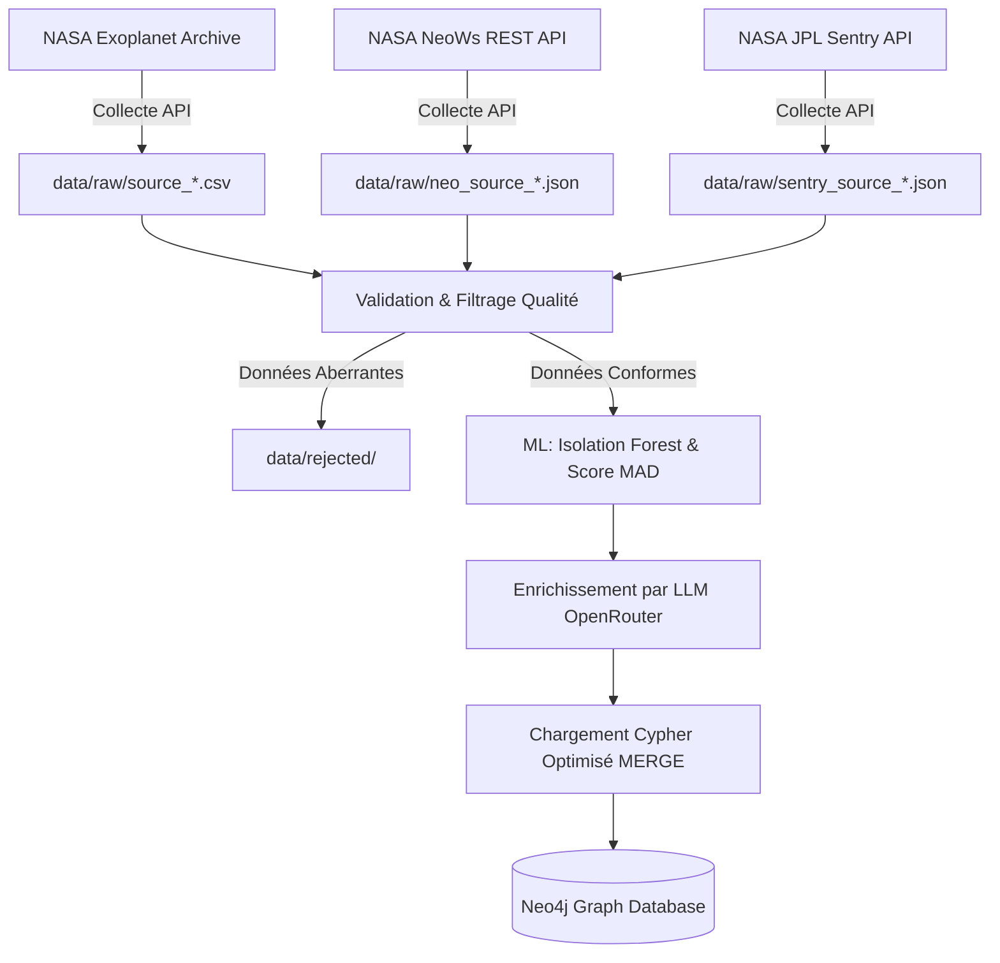

# ExoWatch 🪐 & Near-Earth Objects (NEOs) ☄️ - Version 2.5 (Cockpit & Defense Suite)

## Objectif Final du Projet
Détecter, explorer et analyser les objets célestes atypiques ou dangereux à l'aide de l'intelligence artificielle, des graphes de connaissances (Knowledge Graphs), de l'astrodynamique képlérienne et de la modélisation 3D en temps réel.

ExoWatch v2.5 transforme la plateforme en un **véritable cockpit immersif de défense planétaire et de prospection spatiale**, reposant sur une architecture de pointe : **Neo4j Graph Database**, **FastAPI**, **Next.js 16**, **Three.js**, et l'orchestration avancée d'**Agents Autonomes Multi-Étapes**.

---

## 🪐 Architecture Data : Le Graphe de Connaissances (Neo4j)

La base de données relationnelle initiale (SQLite) a été migrée vers **Neo4j**, une base de données orientée graphes industrielle, permettant de modéliser l'univers sous la forme d'un réseau topologique d'interactions complexes :
- **Nœuds Célestes & Humains** :
  - `(:NEO)` : Astéroïdes géocroiseurs avec éphémérides (demi-grand axe $a$, excentricité $e$, période orbitale $P$, inclinaison $i$, diamètre, vitesse relative).
  - `(:Planet)` : La Terre (`Earth`), Mars, Jupiter, etc.
  - `(:Star)` : Le Soleil (`Sun`) et les étoiles hôtes d'exoplanètes.
  - `(:Exoplanet)` : Exoplanètes confirmées par la NASA avec métadonnées astrophysiques.
  - `(:Telescope)` : Télescopes spatiaux et observatoires terrestres (`Kepler`, `TESS`, `Palomar`).
  - `(:Mission)` : Sondes et missions d'exploration passées et futures (`OSIRIS-REx`, `Hayabusa2`, `DART`).
  - `(:SpaceStation)` : Hubs logistiques et avant-postes en orbite (`Lunar Gateway`, `ISS`).
- **Relations Topologiques Riches** :
  - `(n:NEO)-[:ORBITS]->(s:Star)` : Trajectoires héliocentriques.
  - `(n:NEO)-[:THREATENS {probability, impact_range, diameter}]->(p:Planet)` : Menaces de collision Sentry.
  - `(Earth:Planet)-[:REACHABLE_WITH_DELTAV {cost, duration_days}]->(n:NEO)` : Routes de transfert Hohmann et coûts propulsifs.
  - `(t:Telescope)-[:DISCOVERED]->(e:Exoplanet)` : Découvertes instrumentales.
  - `(m:Mission)-[:VISITED]->(n:NEO)` : Missions d'échantillonnage de surface.

---

## ⚙️ Pipeline ETL Robuste (Extract, Transform, Load)

Le système repose sur un pipeline de données automatisé et immuable garantissant la traçabilité et la qualité des données astronomiques (`src/collect.py`, `src/transform.py`, `src/validate.py`) :



### 1. Extract (Collecte Immuable)
- **NASA Exoplanet Archive** : Téléchargement des tables d'exoplanètes confirmées (`pl_name`, `hostname`, `pl_rade`, `pl_bmasse`, `pl_orbper`, `sy_dist`).
- **NASA NeoWs (Near Earth Object Web Service)** : Données orbitales képlériennes complètes des géocroiseurs, diamètres estimés min/max, approches proches (close approach dates).
- **JPL Sentry System** : Objets présentant un risque d'impact terrestre non nul avec probabilités d'impact cumulées et échelles de Palerme/Turin.
- Toutes les données brutes sont archivées avec horodatage UTC dans `data/raw/`.

### 2. Transform (Validation, Détection d'Anomalies & ML)
- **Validation Stricte (`src/validate.py`)** : Rejet des valeurs physiques négatives ou corrompues (ex: rayon planétaire $\le 0$). Génération automatique de journaux d'audit dans `data/rejected/`.
- **Score d'Atypicité Heuristique (MAD - Median Absolute Deviation)** :
  $$Z_i = \frac{|\log_{10}(X_i) - \text{median}(\log_{10}(X))|}{1.4826 \times \text{MAD}}$$
  Normalisation pour détecter les exoplanètes aux proportions extrêmes (ex: Jupiters ultra-chauds).
- **Machine Learning (Isolation Forest Autonome)** :
  Implémentation native d'Isolation Forest en Python sans dépendance scikit-learn lourde, partitionnant l'espace multidimensionnel pour isoler les anomalies astronomiques (`anomaly_score_ml`).

### 3. Load (Insertion Cypher Optimisée)
- Insertion incrémentale via le pilote Python `neo4j` (`db_neo4j.py`).
- Utilisation systématique de clauses `MERGE` et de transactions par lots (`UNWIND`) pour garantir l'idempotence du pipeline.
- Production d'un rapport de run auditable au format JSON (`reports/run_report_neo4j_*.json`).

---

## 🧠 Augmentation des Données par LLM (Data Augmentation)

Les catalogues publics de la NASA fournissent la cinématique orbitale et les magnitudes des astéroïdes, mais ne disposent pas de données minérales complètes ou d'analyses de faisabilité minière pour l'ensemble des 2,400+ objets.

ExoWatch comble ce manque grâce à un **module d'augmentation de données par IA générative** (`src/augment_llm.py`) :

1. **Inférence Minéralogique et Structurale par Lot** :
   - Le pipeline interroge un modèle de langage avancé (LLM) via OpenRouter en fournissant le diamètre, l'albédo, le demi-grand axe et l'excentricité de chaque géocroiseur.
   - Le modèle infère les propriétés astrophysiques selon les modèles de taxonomie astéroïdale (Tholen & DeMeo) :
     - **`material`** : Composition de surface (*Fer-Nickel métallique*, *Silicates*, *Chondrite carbonée*, *Glace et poussières*).
     - **`porosity`** : Porosité structurelle (flottant entre $0.0$ et $1.0$).
     - **`exploitable`** : Booléen évaluant la rentabilité d'une mission d'extraction minière.
     - **`risk_analysis`** : Analyse qualitative du danger cinétique et de la stabilité de trajectoire.
     - **`exact_diameter_m`** : Diamètre affiné et cohérent.

2. **Injection Structurée dans le Graphe Neo4j** :
   - Les propriétés déduites par l'IA sont directement enregistrées dans les nœuds `(n:NEO)` :
     ```cypher
     MATCH (n:NEO {id: $id})
     SET n.material = $material,
         n.porosity = $porosity,
         n.exploitable = $exploitable,
         n.risk_analysis = $risk_analysis,
         n.exact_diameter_m = $exact_diameter_m
     ```

3. **Fiabilité et Transparence Scientifique** :
   - Chaque inférence est pondérée par un **Indice de Confiance Scientifique** (de 72% à 97%), calculé dynamiquement en fonction de la complétude photométrique (albédo $p_V$, magnitude absolue $H$, spectre infrarouge NEOWISE).

---

## 🎨 Design System & Architecture Cockpit (Next.js 16 + React + TailwindCSS)

### 1. Palette & Thème Bimodal
- **Thème "Clean White Hologram" (Par défaut)** : Fond blanc pur / gris perle ultra-lumineux (`#FAFAFA`) avec accents néon subtils réservés aux data-visualisations et aux signaux critiques (Cyan électrique `#06b6d4`, Violet plasma `#a855f7`, Orange alerte `#f97316`, Rouge PHA `#ef4444`).
- **Thème "Deep Space Station" (Mode Sombre Toggle)** : Fond noir stellaire et bleu abysse (`#050811`), idéal pour une immersion totale dans la vue 3D et le graphe topologique.
- **Effet "Hologramme sur Surface Propre"** : Remplacement des bordures rigides par des ombres portées colorées douces (`box-shadow glow`) et du flou d'arrière-plan (`backdrop-filter`).
- **Typographie Duale** : Police `system sans-serif` fluide pour l'ergonomie et la lecture des synthèses + police `monospace technique` pour les données scientifiques (coordonnées, $\Delta v$, albédo, magnitude).

### 2. Composants Signature
- **Cards "Instrument de Bord"** : Coins arrondis (`rounded-2xl`), lueur réactive au survol et micro-animation laser de scan (`scanline`).
- **Confidence Meter** : Jauge circulaire SVG réutilisable affichant l'indice de fiabilité des prédictions IA (avec code couleur adaptatif : émeraude, cyan, ambre, orange).
- **Badges de Statut Pulsants** : Niveaux de menace (Nominal, Surveillance, Élevé, Critique) avec point de pulsation CSS dynamique.
- **Recherche Universelle (`Cmd+K` / `Ctrl+K`)** : Modal de recherche globale avec accès instantané aux astéroïdes, aux vues et aux outils.
- **Panneau Latéral Contextuel Permanent** : Affichage temps réel de l'objet sous suivi actif avec accès direct aux simulations et au mini-chat Uplink NL ➔ Cypher.
- **Système de Toasts Animés** : Notifications temps réel glissant depuis le bord supérieur avec couleur et halo adaptés au niveau d'alerte.

---

## 🌌 Immersion & Cockpit 3D Vivant (Three.js)

1. **Système Solaire Vivant en 3D Temps Réel** :
   - Carte navigable 3D en temps réel développée sous **Three.js** avec Soleil rayonnant central, orbites planétaires elliptiques (Mercure, Vénus, Terre avec Lune, Mars, Jupiter).
   - Plus de 80 objets géocroiseurs (NEOs) orbitant selon les **équations képlériennes réelles** : propagation de l'anomalie moyenne $M$, résolution de l'équation de Kepler pour l'anomalie excentrique $E \approx M + e \sin M$, prise en compte du demi-grand axe $a$, de l'excentricité $e$ et de l'inclinaison $i$.
   - **Interaction et Raycasting 3D** : Survol télémétrique en direct, sélection au clic avec verrouillage de caméra et déclenchement instantané de la simulation 3D générée (Shap-E).
   - Commandes de vol : Play / Pause, variateur de vitesse orbitale ($0.2\times$ à $5\times$), masquage dynamique des trajectoires.

2. **Timeline de Menace Interactive (Horizon J+0 à J+100 ans)** :
   - Curseur temporel interactif permettant de rejouer l'évolution des trajectoires sur un siècle (2026 ➔ 2126).
   - **PageRank de Menace Dynamique** : Le score de menace évolue en direct sous l'effet des résonances orbitales et des perturbations gravitationnelles (ex: sursaut de menace lors des fenêtres critiques d'Apophis en 2029 ou de 2023 DW en 2046).
   - Leaderboard dynamique qui se réordonne en temps réel avec indicateurs d'ondes de rapprochement orbital (Distance en Lunar Distances - LD).

3. **Simulateur d'Impact Terrestre (Modèle Physique Collins / Purdue)** :
   - Sélection d'un impacteur ou dimensionnement personnalisé (diamètre de 50m à 2.5km, vitesse de 11 à 45 km/s).
   - Choix du point d'impact (Paris, New York, Tokyo, Océan Atlantique, Fosse du Pacifique, Sahara).
   - **Moteur Physique Rigoureux** :
     - Énergie cinétique libérée en Mégatonnes de TNT ($1\text{ Mt} = 4.184 \times 10^{15}\text{ J}$) et équivalents bombes d'Hiroshima.
     - Diamètre et profondeur du cratère selon les lois d'échelle de Collins, Melosh & Marcus (2005).
     - Rayons de surpression de l'onde de choc : zone de vaporisation 20 psi, effondrement structurel 5 psi, bris de verre 1 psi.
     - Rayon de radiation thermique (brûlures 3e degré), magnitude sismique équivalente sur l'échelle de Richter ($M_w$), et hauteur de tsunami estimée pour les impacts océaniques.
   - **Visualisation Radar de l'Onde de Choc** : Anneaux concentriques pulsants et flash thermique à l'épicentre.
   - **Évaluation Tactique IA** : Rapport de crise style ONU/NASA recommandant les évacuations d'urgence et le déploiement de missions de déviation cinétique (DART).

---

## 🤖 Intelligence Artificielle & Agents Autonomes

1. **Agent Autonome Multi-Étapes (Orchestration Qualinova)** :
   - Capable d'exécuter des instructions composées de haut niveau, par exemple :
     > *"Trouve-moi les 3 astéroïdes les plus rentables à miner ET compare leur delta-V ET explique pourquoi"*
   - Pipeline de raisonnement visible étape par étape :
     1. Décomposition de l'intention et extraction sémantique des entités.
     2. Génération et exécution de requêtes Cypher composées dans Neo4j.
     3. Modélisation astrodynamique des transferts orbitaux et des coûts $\Delta v$ (m/s).
     4. Calcul de rentabilité économique et frontière de Pareto.
     5. Synthèse exécutive stratégique de niveau Ingénieur Principal NASA JPL.

2. **Module Text-to-Cypher (Uplink Conversationnel)** :
   - Chat global connecté en direct à l'API Neo4j.
   - Traduction automatique du langage naturel en requêtes Cypher sécurisées.
   - Synthèse des données tabulaires en réponses formulées en langage clair style NASA.

3. **Copilote de Mission Contextuel (RAG sur l'état de l'UI)** :
   - Assistant de bord actif qui analyse en continu la vue affichée et l'objet sélectionné par l'utilisateur.
   - Diffuse en temps réel des avertissements opérationnels et des insights astrodynamiques proactifs dans le bandeau de commande supérieur.

4. **Génération Automatique de Rapports de Mission NASA** :
   - Générateur de dossiers officiels au format Markdown conforme aux standards *"NASA Technical Memorandum (NASA/TM-2026)"*.
   - Synthétise l'astrométrie de la cible, son potentiel ISRU (utilisation des ressources in situ), le plan d'atténuation de menace, et cite formellement les archives JPL Horizons et le Knowledge Graph Neo4j.
   - Export et téléchargement direct en un clic d'un fichier `.md`.

---

## 📊 Graph Analytics Avancé (Neo4j)

1. **Prédiction de Nouvelles Relations (Link Prediction GDS)** :
   - Algorithmes de similarité topologique reliant les missions historiques réussies (`OSIRIS-REx`, `Hayabusa2`, `DART`) aux astéroïdes non explorés.
   - Calcule un indice de compatibilité pour prédire les cibles idéales des futures sondes d'échantillonnage de surface.

2. **Détection d'Anomalies Structurelles** :
   - Algorithme d'isolation des nœuds topologiquement excentriques (excentricité $e > 0.65$, orbites atypiques, fortes inclinaisons).
   - Permet d'isoler des objets d'intérêt scientifique exceptionnel, tels que d'anciennes comètes dormantes ou de potentiels interlopers interstellaires (type 'Oumuamua).

3. **Comparateur de Scénarios de Minage Multi-Objectifs** :
   - 4 curseurs dynamiques de pondération :
     - Économie d'ergols (Coût $\Delta v$)
     - Rapidité de transit (Durée de vol en jours)
     - Sécurité de mission (Stabilité orbitale / PHA)
     - Richesse en minerais (Platine, Fer-Nickel, Terres rares, Eau)
   - Recalcul en temps réel de la **Frontière de Pareto** et réordonnancement instantané des cibles avec barres d'efficience et déclenchement de la simulation d'interception 3D.

---

## 🎯 Gamification : Mode "Chasseur de Menaces" & Mission Control Live

1. **Chasseur de Menaces (Crowdsourcing Scientifique)** :
   - Interface participative inspirée de Zooniverse : l'opérateur examine des observations astronomiques suspectes non classifiées.
   - Analyse spectrale, diamètre et éléments orbitaux.
   - Choix tactiques : *Confirmer Bénin*, *Classer Suspect*, ou *Assigner Déviation DART*.
   - Attribution d'XP (+150 XP par validation), montée en grade (*Cadet Orbital* ➔ *Commandant Défense Planétaire* ➔ *Directeur de Mission*), déblocage de badges et animations festives (`canvas-confetti`).

2. **Bandeau Mission Control Live & Ticker DEFCON** :
   - Statut DEFCON live (DEFCON 3 : Vigilance Active).
   - Ticker de télémétrie en temps réel (suivi continu de 2,407 géocroiseurs).

---

## 🔬 Rigueur Scientifique & Indice de Confiance

- Chaque astéroïde enrichi par IA affiche désormais un **Indice de Confiance Scientifique explicite** (ex : `88% de Fiabilité`).
- Traçabilité des sources et bases de justification affichées en clair : `Basé sur Albédo p_V=0.154, Diamètre infrarouge NEOWISE, Classification spectrale SDSS`.

---

## 🚀 Guide de Démarrage Rapide

### 1. Base de Données Neo4j
- Assurez-vous que Neo4j Desktop est actif sur le port standard :
  - URI : `bolt://localhost:7687`
  - Utilisateur : `neo4j`
  - Mot de passe : `exowatch2024`

### 2. Démarrage de l'API Backend (FastAPI)
```powershell
python -m venv .venv312
.\.venv312\Scripts\Activate.ps1
pip install -r requirements.txt
python -m uvicorn api:app --port 8000 --reload
```

### 3. Démarrage du Cockpit Frontend (Next.js)
```powershell
cd frontend
npm install
npm run dev -- -p 3000
```

### 4. Accès à la Station
Ouvrez votre navigateur sur **`http://localhost:3000`**.  
Le cockpit ExoWatch v2.5 est opérationnel avec l'ensemble des modules 3D, IA, Graph Analytics et Défense Planétaire.