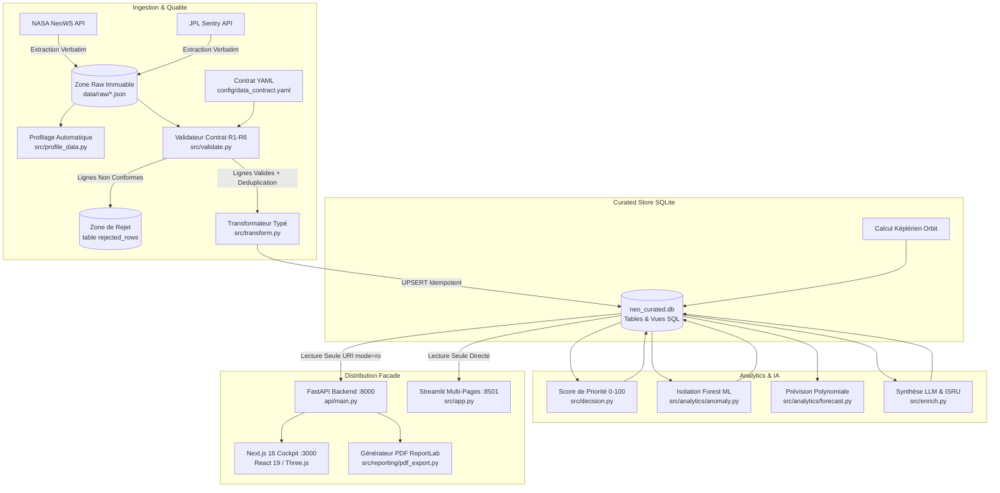

# 🌌 ExoWatch — NEO Intelligence Platform & Planetary Defense Cockpit

[](https://python.org)
[](https://fastapi.tiangolo.com)
[](https://nextjs.org)
[](https://react.dev)
[](https://streamlit.io)
[](https://sqlite.org)
[](https://www.docker.com)
[](https://docs.pytest.org)

**ExoWatch** est une plateforme intégrée de surveillance des géocroiseurs (**Near Earth Objects — NEOs**), d'évaluation du risque d'impact planétaire et d'analyse de rentabilité minière spatiale (**ISRU**).

Conçu selon les standards industriels et les exigences académiques du **TP ESEO (5IA)**, ExoWatch met en œuvre un pipeline de données batch robuste, gouverné par un **contrat de données déclaratif**, une base **SQLite curée strictement idempotente**, des modèles d'**analyse d'anomalies ML (Isolation Forest)** et de **prévision polynomiale**, un **assistant conversationnel Text-to-SQL hermétique**, ainsi qu'une double interface utilisateur :
1. **Frontend Next.js 16 (React 19, TailwindCSS, Three.js, TanStack Query)** : Cockpit spatial Mission Control 100% Dark Mode.
2. **Dashboard Multi-Pages Streamlit** : Console d'ingénierie et d'instrumentation scientifique.

---

## 📑 Sommaire
1. [Architecture Globale & Flux de Données](#-1-architecture-globale--flux-de-données)
2. [Glossaire Scientifique & Technique](#-2-glossaire-scientifique--technique)
3. [Détail et Objectifs de Chaque Module](#-3-détail-et-objectifs-de-chaque-module)
   - [Pipeline Batch & Ingestion sous Contrat](#31-pipeline-batch--ingestion-sous-contrat-etl--data-quality)
   - [Partie A — Assistant Conversationnel Text-to-SQL](#32-partie-a--assistant-conversationnel-text-to-sql-srcagenttext_to_sqlpy)
   - [Partie B — Machine Learning : Détection d'Anomalies & Prévision](#33-partie-b--machine-learning-anomalies-isolation-forest--prévision)
   - [Partie C — Backend REST FastAPI & Docker](#34-partie-c--backend-rest-fastapi--conteneurisation-docker)
   - [Partie D — Visualisation 3D Képlérienne & Rapports PDF](#35-partie-d--visualisation-3d-képlérienne--rapports-pdf)
   - [Frontend Cockpit Next.js 16 (Mission Control)](#36-frontend-cockpit-nextjs-16-mission-control-100-dark)
4. [Guide de Démarrage Rapide](#-4-guide-de-démarrage-rapide-quickstart)
5. [Validation & Tests Unitaires](#-5-validation--tests-unitaires)

---

## 🏗️ 1. Architecture Globale & Flux de Données

Le système fonctionne selon un découpage strict garantissant qu'aucune donnée inférée ou non validée ne puisse corrompre les observations astronomiques réelles :



---

## 📖 2. Glossaire Scientifique & Technique

Pour faciliter la lecture et la soutenance, voici la définition des termes clés employés dans le projet :

| Terme | Définition & Rôle dans ExoWatch |
| :--- | :--- |
| **NEO (Near-Earth Object)** | Tout astéroïde ou comète dont l'orbite s'approche à moins de 1,3 Unité Astronomique du Soleil. |
| **PHA (Potentially Hazardous Asteroid)** | Sous-ensemble critique de géocroiseurs : diamètre estimé $\ge 140\text{ m}$ et distance minimale d'intersection de l'orbite terrestre (**MOID**) $\le 0,05\text{ UA}$ ($\approx 7,5\text{ millions de km}$). |
| **UA (Unité Astronomique / AU)** | Distance moyenne Terre-Soleil ($\approx 149\,597\,870\text{ km}$). Unité de référence pour le demi-grand axe orbital. |
| **LD (Lunar Distance)** | Distance moyenne Terre-Lune ($\approx 384\,400\text{ km}$). Utilisée pour rendre la distance manquée immédiatement compréhensible. |
| **Éléments Képlériens** | Ensemble de 6 paramètres décrivant de manière univoque une orbite elliptique dans l'espace :<br>• $a$ (**semi-major axis**) : taille de l'orbite.<br>• $e$ (**eccentricity**) : aplatissement de l'ellipse ($0 \le e < 1$).<br>• $i$ (**inclination**) : inclinaison par rapport au plan de l'écliptique terrestre.<br>• $\Omega$ (**RAAN**) : longitude du nœud ascendant.<br>• $\omega$ (**argument of perihelion**) : orientation de l'ellipse dans son plan.<br>• $M$ (**mean anomaly**) : position angulaire moyenne de l'objet sur son orbite à l'époque considérée. |
| **Échelle de Turin (Torino Scale)** | Échelle entière de $0$ à $10$ catégorisant le danger d'impact pour le public ($0$ = aucun risque, $10$ = collision certaine causant une catastrophe climatique globale). |
| **Échelle de Palerme (Palermo Scale)** | Échelle logarithmique utilisée par les astronomes comparant la probabilité d'impact de l'objet au risque de fond moyen. Une valeur $> 0$ signale une menace supérieure au risque statistique standard. |
| **ISRU (In-Situ Resource Utilization)** | Exploitation minière des ressources extraterrestres (glace d'eau, métaux du groupe du platine, nickel, fer) pour alimenter les missions spatiales sans transport depuis la Terre. |
| **Isolation Forest** | Algorithme d'apprentissage automatique non supervisé détectant les anomalies géométriques et cinématiques (incohérences taille/vitesse/magnitude) sans étiquetage préalable (paramétré avec une contamination de $5\%$). |
| **Idempotence** | Propriété garantissant qu'une opération exécutée $N$ fois produit exactement le même résultat qu'une seule exécution, sans doublons ni corruption d'état. |
| **URI SQLite `mode=ro`** | Paramètre de chaîne de connexion SQLite au niveau du driver C garantissant qu'aucune écriture physique n'est permise sur le fichier `.db`. |

---

## 🔬 3. Détail et Objectifs de Chaque Module

### 3.1 Pipeline Batch & Ingestion sous Contrat (ETL & Data Quality)
- **Objectif** : Transformer des flux JSON hétérogènes et non contrôlés en données normalisées, typées et de qualité certifiée.
- **Étapes du cycle de vie** :
  1. **Collecte brute (`src/collect.py`)** : Ingestion verbatim depuis les API NeoWS et Sentry, stockage brut horodaté dans `data/raw/` avec politique de repli automatique en cas de rate-limiting (HTTP 429).
  2. **Profilage automatique (`src/profile_data.py`)** : Génère un rapport statistique univarié (`reports/profile_*.txt`) avant toute transformation.
  3. **Validation contractuelle (`src/validate.py` & `config/data_contract.yaml`)** :
     - **R1** : `entity_id` obligatoire et non vide (Rejet).
     - **R2** : `observed_at` date valide et $\le \text{today}$ (Rejet).
     - **R3** : Diamètre minimum strictement positif et dans $[0.0001, 1000.0]\text{ km}$ (Rejet).
     - **R4** : Vélocité relative réaliste dans $[1.0, 200000.0]\text{ km/h}$ (Flag analytique).
     - **R5** : Unicité stricte sur la clé métier `(entity_id, observed_at)` (Déduplication).
     - **R6** : Distance de croisement positive ou nulle (Rejet).
  4. **Stockage curé idempotent (`src/transform.py` & `src/db.py`)** :
     - Insertion dans la base `neo_curated.db` via clause `ON CONFLICT(entity_id, observed_at) DO UPDATE SET`.
     - Les rejets sont consignés dans la table `rejected_rows` avec motif d'erreur et payload brut pour audit.
  5. **Isolation des inférences d'IA (`src/enrich.py`)** :
     - Les analyses de rentabilité minière et résumés opérationnels sont enregistrés dans la table séparée `ai_enrichments` avec horodatage, version du prompt, confiance et nom du modèle.

---

### 3.2 Partie A — Assistant Conversationnel Text-to-SQL (`src/agent/text_to_sql.py`)
- **Objectif** : Permettre à un opérateur de poser des questions en langage naturel ("Quels astéroïdes ont un score de priorité > 80 ?", "Compare les objets dangereux par distance") tout en éliminant mathématiquement tout risque d'injection SQL ou de corruption de base.
- **Mécanismes de protection en 3 couches** :
  1. **Prompt système strict** : Impose au LLM de générer exclusivement une requête `SELECT` SQLite sur une seule ligne.
  2. **Sanitisation syntaxique (`validate_sql`)** : Rejette immédiatement toute requête contenant des mots-clés interdits (`DROP`, `DELETE`, `UPDATE`, `INSERT`, `ALTER`, `ATTACH`, `PRAGMA`), plusieurs instructions séparées par `;`, ou ne commençant pas par `SELECT`.
  3. **Garantie physique système (`execute_readonly`)** : Connexion ouverte avec `sqlite3.connect("file:.../neo_curated.db?mode=ro", uri=True)`. Le moteur SQLite au niveau système d'exploitation bloque toute écriture physique même en cas de contournement de la couche applicative.
- **Auditabilité & Soutenance** : Chaque interaction (question posée, SQL généré, statut de validité, nombre de lignes retournées, modèle employé) est tracée dans la table `agent_queries`.

---

### 3.3 Partie B — Machine Learning : Anomalies (Isolation Forest) & Prévision
- **Détection d'anomalies structurelles (`src/analytics/anomaly.py`)** :
  - Utilise `sklearn.ensemble.IsolationForest(contamination=0.05, random_state=42)`.
  - Entraîné sur 5 features physiques : `diameter_km_min`, `diameter_km_max`, `velocity_kmh`, `miss_distance_km`, `absolute_magnitude`.
  - Détecte les astéroïdes présentant une morphologie atypique (ex : diamètre immense avec vitesse disproportionnée), offrant un signal d'alerte indépendant et complémentaire au classement NASA.
  - Résultats persistés dans la table `anomaly_scores`.
- **Prévision de tendance (`src/analytics/forecast.py`)** :
  - Régression linéaire d'ordre 1 (`numpy.polyfit`) sur l'historique des scores de priorité composite d'un objet.
  - Calcule la pente de variation ($\text{pente} > 0 \implies$ escalade de la menace) et extrapole l'estimation du prochain batch ($T+1$).
  - Affiché visuellement sous forme de sparkline avec extrapolation en pointillé.

---

### 3.4 Partie C — Backend REST FastAPI & Conteneurisation Docker
- **Façade API lecture seule (`api/main.py`)** :
  - `GET /health` : État de santé et connexion SQLite.
  - `GET /briefing/today` : Briefing exécutif complet consolidé.
  - `GET /neo` : Liste paginée des astéroïdes avec filtres (`hazardous_only`, `min_anomaly`, `search`).
  - `GET /neo/{entity_id}` : Fiche unifiée d'un géocroiseur.
  - `GET /neo/{entity_id}/anomaly` & `GET /neo/{entity_id}/forecast` : Données ML.
  - `GET /neo/{entity_id}/orbit` & `GET /neo/orbits/all` : Paramètres képlériens pour rendu 3D.
  - `GET /neo/{entity_id}/trace` : Lignée de données et audit d'ingestion.
  - `GET /mining` : Opportunités d'extraction ISRU issues de la vue `view_minable`.
  - `POST /agent/query` : Endpoint de l'assistant Text-to-SQL.
  - `GET /reports/latest` & `GET /reports/{run_id}/pdf` : Téléchargement du rapport exécutif PDF.
  - **CORS** activé pour permettre le dialogue avec le frontend Next.js sur `http://localhost:3000`.
- **Conteneurisation Multi-Conteneurs** :
  - [`Dockerfile`](Dockerfile) : Image Python 3.12-slim pour l'API et Streamlit.
  - [`frontend/Dockerfile`](frontend/Dockerfile) : Image Node 20-slim multi-stage pour le frontend Next.js.
  - [`docker-compose.yml`](docker-compose.yml) : Orchestre les services `api` (8000), `streamlit` (8501) et `frontend` (3000) autour du volume persistant `./data`.
- **Intégration Continue (CI)** :
  - Workflow GitHub Actions [`.github/workflows/ci.yml`](.github/workflows/ci.yml) exécutant les 14 tests unitaires et le build Docker à chaque `push` ou `pull_request`.

---

### 3.5 Partie D — Visualisation 3D Képlérienne & Rapports PDF
- **Solveur de mécanique orbitale képlérienne** :
  - Applique les formules analytiques d'orbites képlériennes pour projeter l'ellipse dans le repère cartésien 3D héliocentrique écliptique J2000.
  - Tracé dans Streamlit via **Plotly Scatter3D** ([`src/pages/6_Vue_3D.py`](src/pages/6_Vue_3D.py)).
  - Rendu en temps réel dans Next.js via **Three.js** ([`frontend/src/components/OrbitViewer.tsx`](frontend/src/components/OrbitViewer.tsx)) avec rotation, zoom, focus interactif sur la Terre (1 UA) et les orbites colorées selon le niveau de menace.
- **Rapports de mission PDF exécutifs (`src/reporting/pdf_export.py`)** :
  - Génère un document PDF mis en page avec **ReportLab**.
  - Inclut le statut du run batch, la synthèse de la directive IA du jour, le tableau du Top 3 des priorités et l'audit des rejets qualité.

---

### 3.6 Frontend Cockpit Next.js 16 (Mission Control 100% Dark)
- Développé en **Next.js 16 (App Router)** avec **React 19**, **TailwindCSS**, **TanStack React Query**, **Zustand** et **Three.js**.
- **Design System Mission Control 100% Dark Mode** :
  - Palette : Fond spatial `#0A0E14`, cartes instruments `#131820`, accents néon cyan `#00D9FF`, alerte rouge critique `#ff4757`, vert nominal `#2ed573`.
  - Grille radar en arrière-plan, scrollbars personnalisées, animations de pulsation sur les menaces critiques.
- **Pages disponibles** :
  - `/` : **Briefing de Mission du Jour** (Top 3 priorités avec sparklines et projections, alertes de variation, opportunité minière, top 5 anomalies ML, export PDF).
  - `/objects` : **Surveillance Géocroiseurs** (table filtrable en direct avec recherche textuelle et filtres PHA / Anomalies ML).
  - `/objects/[entityId]` : **Fiche Télémétrique Unifiée** (observations, paramètres orbitaux, enrichissements IA).
  - `/mining` : **Catalogue Minier ISRU** (jauges de confiance circulaires animées).
  - `/orbit` : **Visualisateur 3D Orbital Képlérien** (Three.js avec sélecteur de focus).
  - `/assistant` : **Assistant Text-to-SQL Interactif** (chat avec accordéon d'inspection de la requête SQL).
  - `/trace` : **Traçabilité & Data Lineage** (cycle de vie des transformations par entité).
  - `/reports` : **Observabilité des Runs & Export PDF** (téléchargement direct).

---

## ⚡ 4. Guide de Démarrage Rapide (Quickstart)

### 4.1 Prérequis
- **Python 3.12+**
- **Node.js 20+** et `npm`
- **Docker & Docker Compose** (optionnel pour l'exécution conteneurisée)

### 4.2 Installation Locale

```bash
# 1. Cloner le projet
git clone https://github.com/kratos45/exowatch.git
cd exowatch

# 2. Configurer l'environnement Python
python -m venv .venv
# Windows :
.\.venv\Scripts\activate
# Linux/macOS :
source .venv/bin/activate

# 3. Installer les dépendances Python
pip install -r requirements.txt

# 4. Configurer les variables d'environnement
cp .env.example .env
# Renseigner OPENROUTER_API_KEY si souhaité (optionnel, fallback heuristique déterministe inclus)
```

### 4.3 Initialiser la Base et Exécuter un Run du Pipeline
```bash
# Initialise les tables et vues SQLite
python -c "from src.db import init_db; init_db()"

# Exécute un batch d'ingestion complet (Collecte -> Profilage -> Validation -> UPSERT -> Priorité -> Anomalie ML -> LLM)
python -c "from src.pipeline import run_pipeline; run_pipeline()"
```

### 4.4 Lancement des Services en Local

#### Option A : Lancement via Docker Compose (Recommandé)
Lance l'ensemble de la suite (FastAPI sur 8000, Next.js sur 3000, Streamlit sur 8501) :
```bash
docker compose up --build
```

#### Option B : Lancement Manuel (Terminaux séparés)

**Terminal 1 — Backend FastAPI (Port 8000)** :
```bash
uvicorn api.main:app --host 0.0.0.0 --port 8000 --reload
# Documentation Swagger interactive disponible sur : http://localhost:8000/docs
```

**Terminal 2 — Frontend Cockpit Next.js (Port 3000)** :
```bash
cd frontend
npm install --legacy-peer-deps
npm run dev
# Interface Mission Control accessible sur : http://localhost:3000
```

**Terminal 3 — Dashboard Streamlit (Port 8501)** :
```bash
streamlit run src/app.py
# Application Streamlit accessible sur : http://localhost:8501
```

---

## ✅ 5. Validation & Tests Unitaires

La suite de tests unitaires valide l'intégrité de la gouvernance des données, la reproductibilité et la sécurité :

```bash
pytest tests/ -v
```

### Couverture des tests (`14/14 PASSED`) :
- [`tests/test_quality.py`](tests/test_quality.py) : Validation des 6 règles du contrat de données (R1 non nul, R2 date valide, R3 diamètre positif, R4 vélocité réaliste, R5 unicité, R6 distance positive).
- [`tests/test_idempotence.py`](tests/test_idempotence.py) : Vérification de la non-duplication et de l'idempotence stricte lors des rejeux batch.
- [`tests/test_analytics.py`](tests/test_analytics.py) : Validation du modèle Isolation Forest (`compute_anomaly_scores`) et de la prévision polynomiale (`forecast_priority_trend`).
- [`tests/test_text_to_sql.py`](tests/test_text_to_sql.py) : Validation des requêtes `SELECT`, rejet des instructions dangereuses (`DROP`, `DELETE`, `UPDATE`, `;`), et garantie de lecture seule via `?mode=ro`.

---

## 🏛️ Structure du Dépôt

```
exowatch/
├── api/
│   └── main.py                     # Façade REST FastAPI en lecture seule
├── config/
│   └── data_contract.yaml          # Contrat de qualité déclaratif (R1-R6)
├── data/
│   ├── raw/                        # Ingestion brute immuable (JSON)
│   └── curated/
│       └── neo_curated.db          # Base SQLite curée (observations, priorités, enrichissements)
├── docs/                           # Documentation d'architecture & diagrammes ER
├── frontend/                       # Application Cockpit Next.js 16 (React 19 / Three.js)
│   ├── Dockerfile
│   ├── src/app/                    # Pages : Briefing (/), objects, mining, orbit, assistant, trace, reports
│   ├── src/components/             # Navbar, OrbitViewer, ChatWindow, UI components
│   ├── src/lib/                    # api.ts (hooks React Query), orbital-mechanics.ts
│   └── src/store/                  # useSelectionStore.ts (Zustand)
├── pages/ et src/pages/            # Pages Streamlit (Briefing, Menaces, Minage, Traçabilité, Runs, Assistant, 3D)
├── reports/                        # Rapports de profilage, run_reports JSON et exports PDF
├── src/
│   ├── agent/                      # Text-to-SQL (génération, validation, exécution ro)
│   ├── analytics/                  # Isolation Forest (anomaly.py) & Régression (forecast.py)
│   ├── reporting/                  # Générateur PDF ReportLab
│   ├── ui/                         # Thème CSS et composants Mission Control pour Streamlit
│   ├── app.py                      # Point d'entrée Streamlit
│   ├── collect.py                  # Collecteur NASA / Sentry avec backoff
│   ├── db.py                       # Schéma SQLite, initialisation et vues
│   ├── decision.py                 # Algorithme de score de priorité et alertes
│   ├── enrich.py                   # Inférences LLM isolées
│   ├── pipeline.py                 # Orchestrateur batch de bout en bout
│   ├── profile_data.py             # Profilage univarié
│   ├── transform.py                # Transformateur typé et extraction képlérienne
│   └── validate.py                 # Moteur de validation contractuelle
├── tests/                          # 14 tests unitaires Pytest
├── docker-compose.yml              # Orchestration multi-services (API, Streamlit, Frontend)
├── Dockerfile                      # Image Docker de production Python
├── requirements.txt                # Dépendances Python épinglées
└── README.md                       # Documentation complète du projet
```

---

## 👨‍💻 Auteurs & Cadre Académique
Projet réalisé dans le cadre du module d'Ingénierie des Données & IA (5IA) à l'**ESEO**.
Gouvernance des données, reproductibilité certifiée, sécurité garantie et architecture proportionnée au besoin.