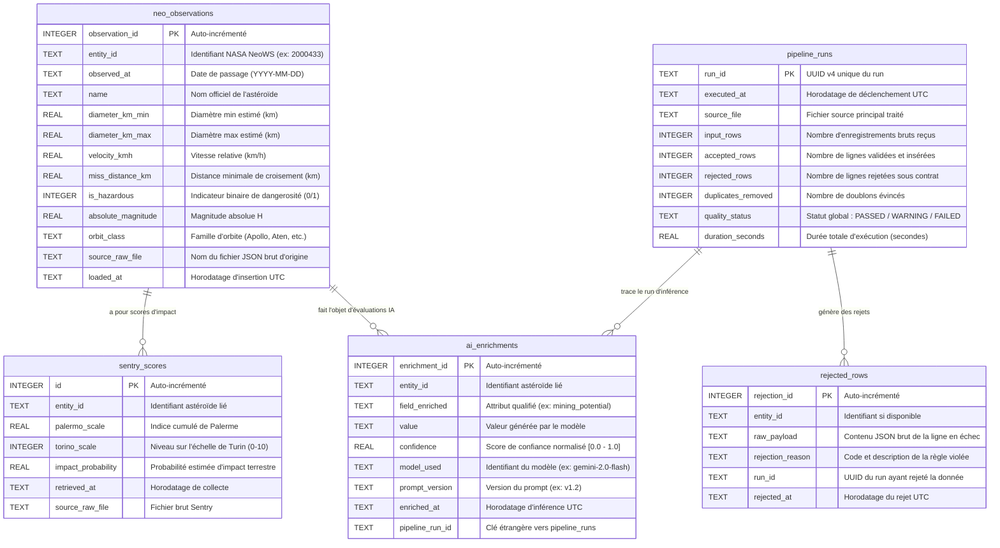

# Modèle Entité-Association (ER Diagram) — ExoWatch Curated Store

Ce document présente l'architecture de la base de données relationnelle locale (`neo_curated.db` sous SQLite), conçue pour garantir la traçabilité intégrale, l'idempotence stricte et l'isolation des données mesurées et inférées.

---

## 1. Diagramme Mermaid

---

## 2. Dictionnaire des Tables et Clés

### `neo_observations`
- **Rôle** : Référentiel des observations validées d'astéroïdes proches de la Terre.
- **Clé Métier & Contrainte d'Unicité** : `UNIQUE(entity_id, observed_at)`
  - Permet à un astéroïde d'avoir plusieurs passages documentés à des dates différentes.
  - Empêche strictement l'insertion de doublons lors de la ré-exécution du pipeline (principe d'idempotence via SQLite UPSERT).

### `sentry_scores`
- **Rôle** : Suivi des risques d'impact selon les systèmes d'alerte automatisés de la NASA/JPL.
- **Liaison** : Rattaché logiquement par `entity_id`.

### `ai_enrichments`
- **Rôle** : Historisation immuable des estimations de potentiel d'exploitation minière et d'in-situ resource utilization (ISRU) dérivées par LLM.
- **Traçabilité** : Chaque enregistrement conserve la version exacte du prompt (`prompt_version`), le modèle d'inférence (`model_used`) et le run d'exécution (`pipeline_run_id`).

### `pipeline_runs`
- **Rôle** : Journal d'audit chronologique de tous les batchs d'ingestion.
- **Clé Primaire** : `run_id` (UUID4).

### `rejected_rows`
- **Rôle** : Zone de quarantaine documentée recueillant toute ligne ayant enfreint le contrat de données (R1, R2, R3, R6). Conserve le payload brut pour analyse et rejeu ultérieur.

---

## 3. Justification de la Séparation stricte : Mesuré vs Inféré

> **Principe Pédagogique Fondamental (Règle n°5)** : Ne jamais mélanger les observations physiques issues d'instruments scientifiques avec des données inférées par des modèles d'intelligence artificielle statistique.

1. **Intégrité Scientifique** : Les colonnes de `neo_observations` représentent des mesures astronomiques directes (photométrie, radar de Goldstone, astrométrie). Aucune inférence probabiliste ne doit altérer ou masquer ces métriques.
2. **Évolution & Reproductibilité des Modèles** : Les LLM évoluent rapidement. Séparer `ai_enrichments` permet de ré-inférer les caractéristiques d'un astéroïde avec un nouveau modèle (`model_used`) ou une nouvelle variante de prompt (`prompt_version`) sans toucher aux données sources.
3. **Auditabilité des Décisions** : Les utilisateurs et analystes peuvent examiner le score de confiance (`confidence`) et la justification scientifique de manière isolée sans créer de biais dans les filtres de sécurité planétaire.
